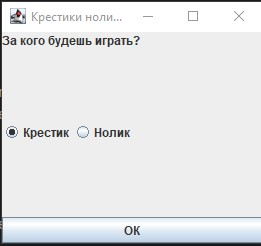
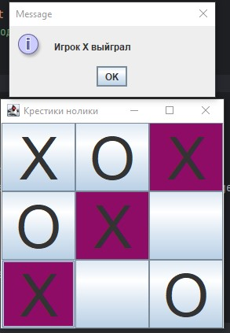
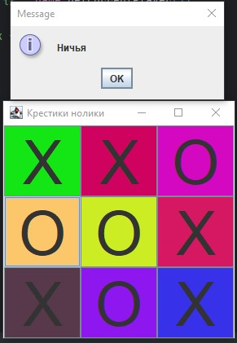

# Крестики-Нолики

## Описание
Крестики-нолики - это классическая игра для двух игроков, в которой они по очереди ставят свои знаки (X и O) на квадратном поле 3x3. 
Цель игры - собрать три своих знака в ряд (по горизонтали, вертикали или диагонали).

## Требования

- Java JDK 8 или выше
- Библиотеки (в папке `libs`)

## Установка

1. Склонируйте репозиторий или скачайте его как ZIP-архив.
2. Убедитесь, что у вас установлена Java. Вы можете проверить это, выполнив команду:
   ```bash
   java -version

## Компиляция
Если вы хотите скомпилировать проект самостоятельно, выполните следующие команды:

```bash
javac -cp "libs/*" -d bin -proc:none src/GUI/TicTacToyGUI.java src/controller/GameController.java src/game/AI/TicTacToyAI.java src/game/AI/impl/TicTacToyAISimpleImpl.java src/game/TicTacToyGame.java src/Main.java.
```

## Запуск программы
### Для Windows
1. Скачайте или скопируйте файл run_tictactoy.bat в папку с TicTacToy.jar и папкой libs.
2. Дважды щелкните по run_tictactoy.bat, чтобы запустить игру.
### Для Linux/macOS
1. Скачайте или скопируйте файл run_tictactoy.sh в папку с TicTacToy.jar и папкой libs.
2. Сделайте скрипт исполняемым:

```bash
chmod +x run_tictactoy.sh
```
### Запустите игру:
```bash
./run_tictactoy.sh
```
###### Принцип игры
Игрок выбираtn ячейки.
Игра продолжается до тех пор, пока игрок или компьютер не соберет три 
знака в ряд или не закончится ничья.

### Пример работы программы

*Стартовая страница*



*Игрок Х выйграл*



*Ничья*

